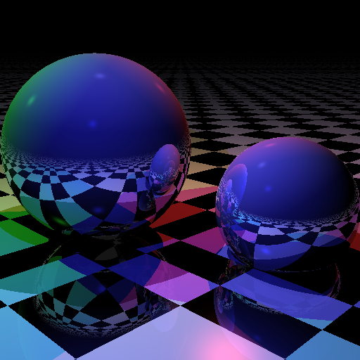

# Ray Tracer

## Introduction ##

The main goal of the project was to rewrite this project - https://github.com/tcbrindle/raytracer.hpp - into Delphi language.
The idea of this code is not to render the image at compile-time. 

## Performance ##

The rendering time for a 512 by 512 image is approximately 1.5 seconds.
